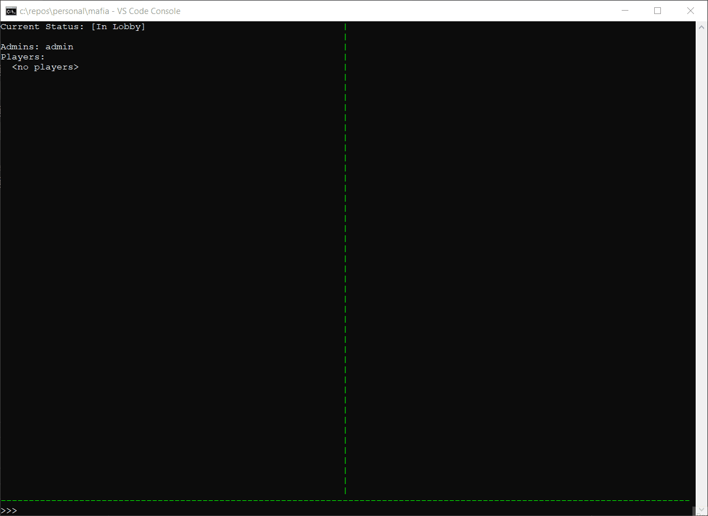

# Open Mafia Engine

[](https://badge.fury.io/py/open-mafia-engine)
[](https://open-mafia-engine.readthedocs.io/en/latest/)

[](https://github.com/open-mafia/open_mafia_engine/actions/workflows/python-testing.yml)

The Open Mafia Engine is a flexible, open-source game engine for Mafia-like games.

See the [Wikipedia article](https://en.wikipedia.org/wiki/Mafia_%28party_game%29)
for information on what Mafia/Werewolf is.

The Open Mafia Engine actually allows a much broader type of game to be played,
with custom roles and very intricate "setups". Most of these custom roles come
from either "real-life" games or online forums such as
[MafiaScum](https://wiki.mafiascum.net/index.php?title=Main_Page) and
[Bay12Games Mafia Subforum](http://www.bay12forums.com/smf/index.php?board=20.0).

## Features

- Event-based architecture, which allows for very complex interactions.
- Many built-in abilities, victory conditions, etc.
  (Not "many" yet, but we're working on it!)
- Games are defined declaratively or using an parametrized GameBuilder.
- Open source & extensible.

## Installing

Install the latest stable version via pip:

`pip install open_mafia_engine`

See the [dev docs](docs/development/installing_dev.md) to install for local
development (using Poetry).

## Getting started

This example starts a 5-player "test" mafia game (1 mafioso vs 4 townies):

```python
import open_mafia_engine.api as mafia

builder = mafia.GameBuilder.load("test")
players = ['Alice', 'Bob', 'Charlie', 'Dave', 'Eddie']
game = builder.build(players)
```

## Example Application

This repository includes an example text-based Mafia app, runnable like:

```bash
mafia-cli
# or
python -m open_mafia_engine.example.cli
```

This is what the UI looks like:


